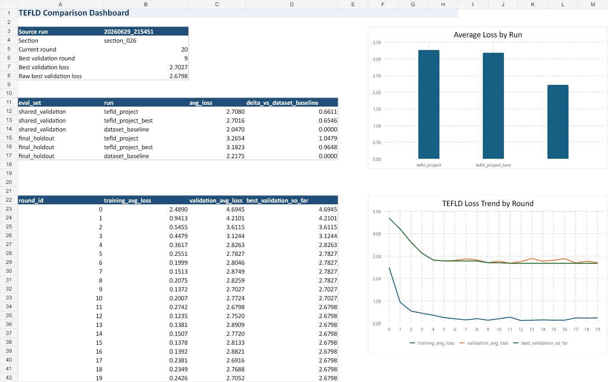

# Token Efficient Loss Driven Active Learning

TEFLD is a prototype active-learning loop for improving a local language model with small, high-value training batches.

Instead of training on random data, TEFLD uses model loss to decide what to train next. Each round builds a 10-sample batch, trains a LoRA adapter, evaluates the student, records failures, and uses those failures to shape the next round.

## Why Loss-Driven Active Learning?

TEFLD is meant to spend training tokens where the student is weakest. The included comparison snapshot shows the loop rapidly reducing its own generated-curriculum training loss and improving shared validation loss through the early rounds, with the best validation checkpoint at round `9` (`2.7027` shared validation loss). On the broader holdout set, TEFLD's best checkpoint reached `3.1823` average loss versus `2.2175` for the dataset baseline, which suggests the loop learned its targeted curriculum but did not fully cover the wider Dolly-style distribution.



See [comparison_data/README.md](comparison_data/README.md) for the compact comparison summary, CSV tables, dashboard image, and Excel workbook.

## What This Repository Contains

This repository is the standalone TEFLD project only.

Included:

- TEFLD orchestrator
- policy and diversity planner
- instructor data generation
- student LoRA training
- evaluator, ledger, and failure vault
- prompt templates
- a CLI runner for TEFLD-only runs
- compact comparison snapshot under `comparison_data/`

Not included:

- dataset baseline comparison code
- raw experiment run outputs
- generated LoRA adapters
- downloaded Hugging Face datasets
- notebooks and scratch scripts

## Project Flow

```text
example.txt
    |
    v
Orchestrator
    |
    v
Policy + Diversity Planner
    |
    v
Instructor creates a 10-sample batch
    |
    v
Student trains a LoRA adapter
    |
    v
Evaluator measures loss
    |
    v
Ledger + failure vault
    |
    v
Next round
```

For the detailed resumable runner behavior, see [ORCHESTRATOR.md](ORCHESTRATOR.md).

## Repository Layout

```text
.
|-- README.md
|-- ORCHESTRATOR.md
|-- requirements.txt
|-- run_tefld.py
|-- comparison_data/
|   |-- README.md
|   |-- dashboard.png
|   |-- TEFLD_comparison_summary.xlsx
|   `-- *.csv
`-- TEFLD/
    |-- main.py
    |-- src/
    |   |-- dataschema.py
    |   |-- helper.py
    |   |-- diversity_planner.py
    |   |-- policy.py
    |   |-- instructor.py
    |   |-- student.py
    |   |-- evaluator.py
    |   |-- orchestrator.py
    |   `-- prompts/
    |       |-- LossTagAvg.txt
    |       |-- instruction_prompt.txt
    |       `-- data_prompt.txt
    |-- data/
    |   |-- sections_index.json
    |   `-- sections/
    `-- Models/
```

## Setup

Create and activate an environment on Windows PowerShell:

```powershell
python -m venv .venv
.\.venv\Scripts\Activate.ps1
python -m pip install --upgrade pip
pip install -r requirements.txt
```

Or on macOS/Linux:

```bash
python3 -m venv .venv
source .venv/bin/activate
python -m pip install --upgrade pip
pip install -r requirements.txt
```

Or with conda:

```bash
conda create -n tefld python=3.11
conda activate tefld
pip install -r requirements.txt
```

Create your local environment file:

```powershell
Copy-Item .env.example .env
```

On macOS/Linux:

```bash
cp .env.example .env
```

Then edit `.env`:

```env
OPENAI_API_KEY=your_api_key_here
BASE_MODEL_DIR=D:\path\to\local\models
```

For macOS/Linux, `BASE_MODEL_DIR` should use your local path style, for example:

```env
BASE_MODEL_DIR=/path/to/local/models
```

TEFLD expects you to bring a local Hugging Face-compatible causal language model; model weights are not downloaded or included in this repository. `BASE_MODEL_DIR` is optional if you pass a full model path with `--student-model-id`.

Known configured/tested local target: `gemma-4-E2B-it`, which is the default `--student-model-id` and the model family the current LoRA target-module logic is tuned around. Other causal LM families may work, but you may need to adjust the LoRA target modules in [TEFLD/src/student.py](TEFLD/src/student.py) and retune rank, alpha, learning rate, epochs, and sequence length for your model size.

## Quick Start

Create a fresh section and an `example.txt` template:

```powershell
python run_tefld.py --new-section --bootstrap-only
```

Open the printed `example_path` and fill it.

Plain example format:

```text
Sample:
What is the capital city of Canada?

Output:
The capital city of Canada is Ottawa.
```

Contextual example format:

```text
Instruction:
When did the Silverleaf Library add a children's reading room?

Context:
The Silverleaf Library opened in 1984. It started with 12,000 books and added a children's reading room in 2001.

Output:
The Silverleaf Library added a children's reading room in 2001.
```

After filling `example.txt`, run one full TEFLD round:

```powershell
python run_tefld.py --rounds 1
```

On the first evaluated run, TEFLD also creates `shared_validation.json`: a fixed 10-sample validation set used for best-checkpoint and rollback decisions. You can replace that file with your own held-out samples from the same broad distribution you care about; keeping it fixed is important because training-batch loss is too easy to overfit.

Run multiple rounds:

```powershell
python run_tefld.py --rounds 5
```

Build the next training batch without training:

```powershell
python run_tefld.py --build-only
```

Use a specific section:

```powershell
python run_tefld.py --section-id section_001 --rounds 1
```

Use a local model path:

```powershell
python run_tefld.py --student-model-id "D:\hugginghub\hub\gemma-4-E2B-it" --rounds 1
```

On macOS/Linux:

```bash
python run_tefld.py --student-model-id "/path/to/huggingface/gemma-4-E2B-it" --rounds 1
```

Disable API semantic grouping in policy:

```powershell
python run_tefld.py --disable-api-grouping --rounds 1
```

## Important Files

Each section stores its own state under:

```text
TEFLD/data/sections/section_XXX/
```

Key files:

- `example.txt`: seed examples provided by the user
- `shared_validation.json`: fixed holdout-like validation samples for checkpoint selection
- `difficulty_config.json`: editable difficulty budgets for generation levels
- `pipeline_state.json`: current round, active recipe, current batch, planner state
- `OverAllData.json`: full evaluated ledger
- `failure_vault.json`: compact high-loss memory for recycling
- `debug_log.jsonl`: round-by-round event log

Adapters are saved under:

```text
TEFLD/Models/section_XXX/round_YYY/
```

## Current Training Defaults

- fixed round batch size: `10`
- trainer micro-batch size: `1`
- gradient accumulation: `4`
- learning rate: `2e-4`
- epochs per round: `1`
- max sequence length: `512`
- LoRA rank: `4`
- LoRA alpha: `8`
- LoRA dropout: `0.05`

The student masks prompt tokens and padding tokens with `-100`, so training loss is computed only on the expected answer. Checkpoint selection uses the fixed `shared_validation.json` loss when evaluation is enabled; pass `--disable-shared-validation` only if you intentionally want to fall back to training-batch loss.

The policy hard-generation thresholds in [TEFLD/src/policy.py](TEFLD/src/policy.py) are currently tuned to the observed loss scale of the known configured/tested local target, `gemma-4-E2B-it`. If you switch model families or sizes, retune those constants or replace them with history/percentile-based thresholds.

Difficulty is adaptive. The planner starts from a per-section `difficulty_config.json`, records requested and observed difficulty on generated samples, retries severe generation misses once, and stores the current difficulty regime in `pipeline_state.json`.

## GitHub Notes

Generated project state and adapters are ignored by `.gitignore`:

- `.env`
- `TEFLD/data/sections/*`
- `TEFLD/data/prompt_cache/`
- `TEFLD/Models/*`
- Python cache files

That keeps the repository small and source-focused. Commit source code, prompt templates, and docs. Do not commit model weights, API keys, generated section ledgers, or LoRA adapters.

The `comparison_data/` folder is intentionally small and GitHub-friendly. GitHub can render its Markdown summary, CSV files, and dashboard image in the browser. Download the Excel workbook from that folder for the formatted multi-sheet view.

## Minimal Run Checklist

Windows PowerShell:

```powershell
git clone <your-repo-url>
cd "Token efficient loss driven active learning"
python -m venv .venv
.\.venv\Scripts\Activate.ps1
pip install -r requirements.txt
Copy-Item .env.example .env
python run_tefld.py --new-section --bootstrap-only
python run_tefld.py --rounds 1
```

macOS/Linux:

```bash
git clone <your-repo-url>
cd "Token efficient loss driven active learning"
python3 -m venv .venv
source .venv/bin/activate
pip install -r requirements.txt
cp .env.example .env
python run_tefld.py --new-section --bootstrap-only
python run_tefld.py --rounds 1
```
